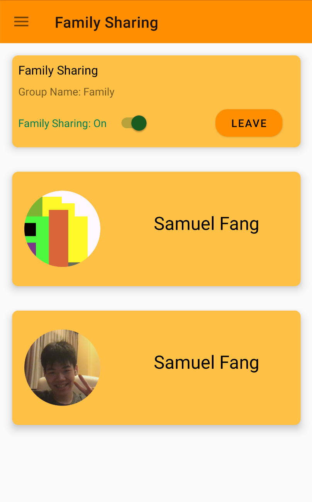

# FoodCache

FoodCache is a Food Management App that helps reduce food wastage by keeping track of expiring ingredients, suggest recipes for meals to minimize food waste and act as a platform to share excess food and ingredients with friends and family. 

FoodCache is a project by team Breakfast Set A (Jarveis and Samuel) for CP2106 (Orbital), a summer-long self-directed, independent work course. The project acheived the Apollo 11 (Advanced) level of achievement. 

# Track Expiry Dates

The FoodCache page keeps track of the expiry dates of items, notifying the user when an item is about to expire. It supports intuitive swiping gestures to remove expired ingredients and easy ways to edit ingredient quantities and expiry dates. Items can also be added using a barcode scanner. The expiry date of items that are added are intelligently predicted.

# Shopping List

The Shopping List keeps track of ingredients that you need to purchase. Items that have expired are automatically added to the shopping list and items from the shopping list can be automatically added to the FoodCache based on users habits. 

# Family Sharing

The Family Sharing feature allows friends and family who live in the same household to sync up their FoodCache and Shopping Lists. Changes to one users FoodCache or Shopping List will be reflected in other users FoodCache and Shopping Lists.

# Discover Recipes

The Discover Recipes Menu allows users to discover new recipes and save their favourites to their own RecipeCache. It supports searching and filtering by cuisine and other tags. Recipes are uploaded and maintained by the community. 

In addition, the recommend recipes feature intelligently recommend recipes that best makes use of the existing ingredients in a users FoodCache, while taking into consideration their preferences and avoiding recommending the same recipe too many times.

# Recipe Page

The recipe page allows user to see recipe details at a glance. Users can choose to prepare the recipe, which will bring them to a screen where they will be guided through step by step instructions. Once they have prepared the meal, ingredients used are automatically removed from their FoodCache. 

# Social Features

Social Features are deeply integrated into FoodCache. Users can add other users as friends. Once they accept, recipes, blogs, social posts, and ingredient requests shared by their friends will appear on their social feed. 

# Many More Features!

FoodCache has many more minor features not shown here, such as profile pages, third-party login authentication, user friendly pages to add and edit ingredients and recipes and smart algorithms to recommend recipes based on recipe scores. 

We currently do not push some keys, so you may not be able to run the application if you clone the repo.